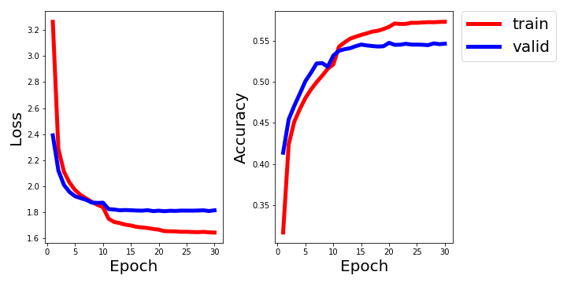

# VQA
Pytorch implementation of the paper - VQA: Visual Question Answering (https://arxiv.org/pdf/1505.00468.pdf).


## Usage 

#### 1. Clone the repositories.
```bash
$ git clone https://github.com/tbmoon/basic_vqa.git
```

#### 2. Download and unzip the dataset from official url of VQA: https://visualqa.org/download.html.

```bash
$ cd basic_vqa/utils
$ chmod +x download_and_unzip_datasets.csh
$ ./download_and_unzip_datasets.csh
```

#### 3. Preproccess input data for (images, questions and answers).

```bash
$ python resize_images.py --input_dir='../datasets/Images' --output_dir='../datasets/Resized_Images'  
$ python make_vacabs_for_questions_answers.py --input_dir='../datasets'
$ python build_vqa_inputs.py --input_dir='../datasets' --output_dir='../datasets'
```

#### 4. Train model for VQA task.

- Please have loop in train.py file to see all arguments to pass while training.
```bash
$ cd ..
$ python train.py
$ python train.py --learning_rate=0.003
```

## Results

- Comparison Result

| Model | Metric | Dataset | Accuracy | Source |
| --- | --- | --- | --- | --- |
| Paper Model | Open-Ended | VQA v2 | 54.08 | [VQA Challenge](https://visualqa.org/roe.html) |
| My Model | Multiple Choice | VQA v2 | **54.72** | |


- Loss and Accuracy on VQA datasets v2




## References
* Paper implementation
  + Paper: VQA: Visual Question Answering
  + URL: https://arxiv.org/pdf/1505.00468.pdf
    
* Pytorch tutorial
  + URL: https://pytorch.org/tutorials/
  + Github: https://github.com/yunjey/pytorch-tutorial
  + Github: https://github.com/GunhoChoi/PyTorch-FastCampus

* Preprocessing
  + Tensorflow implementation of N2NNM
  + Github: https://github.com/ronghanghu/n2nmn
